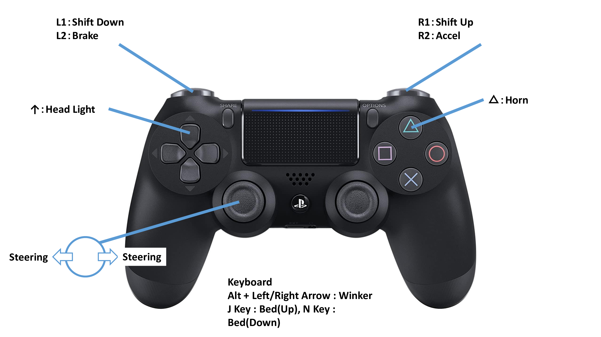

# DumpTruckについて

OCSで使用するDumpTruckの情報をまとめています。  
OcsVehicleでは参考用にDumpTruckを１台収録しているのでご確認ください。

※改善点があれば[Issue](https://github.com/Field-Robotics-Japan/OcsVehicle/issues)へのコメントをよろしくお願い致します。

## 操作方法

重機の操作はUnityのInputSystemを使用していますが、必要に応じて[キーコンフィグ](../../../Scripts/InputSystem/VehicleInput.inputactions)を修正してください。

## Prefabの基本構成

DumpTruckは下記のような構成を基本としています。  
必要に応じてリンクの追加や親子関係の変更をしてください。

- DumpTruck(root)
  - Body
    - Work
    - EngineSound
  - Suspension
    - Hub.FL
      - Wheel.FL
    - Hub.FR
      - Wheel.FR
    - Hub.RL
      - Wheel.RL
    - Hub.RR
      - Wheel.RR
    - Hub.RL2
      - Wheel.RL2
    - Hub.RR2
      - Wheel.RR2
  - Equipments(optional)
    - Lights
    - Winkers
    - Hone

## コンポーネント一覧

DumpTruckに使用しているC#スクリプトの一覧です。  
下記以外にもRigidBodyなど様々なコンポーネントを使用しているので、詳しくはOcsVehicleに収録しているモデルを参照してください。

- [DumpTruck.cs](../../../Scripts/Vehicle/DumpTruck.cs)
- [DumpTruckController.cs](../../../Scripts/Controller/DumpTruckController.cs)
